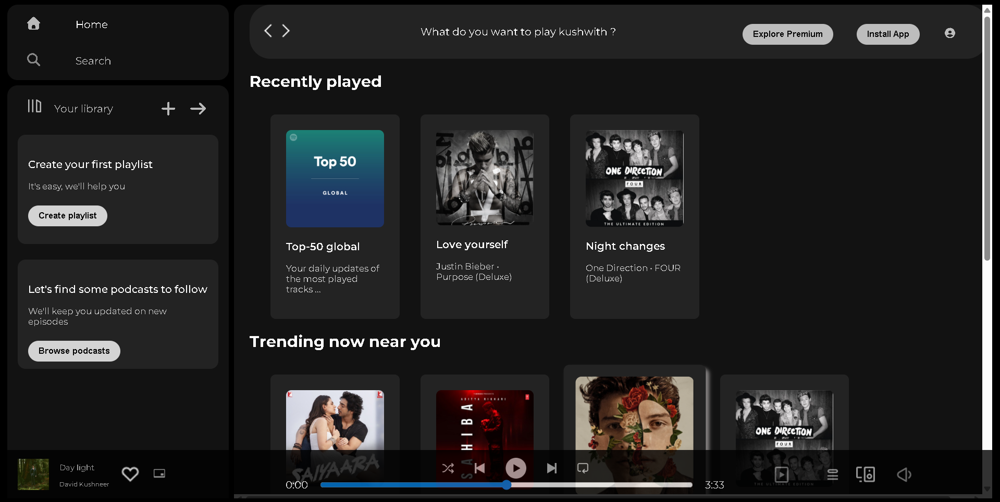

# Spotify Clone 🎧

A sleek, responsive web UI inspired by [Spotify](https://spotify.com), built with pure HTML and CSS.

## 💡 Features

- 🎨 Modern, clean, Spotify-like layout
- 🖼️ Custom sidebar, library, and card components
- 🎵 Fixed music player bar with album info and controls
- 🔍 Responsive design (desktop & mobile breakpoints)
- 🚀 Smooth hover effects & transitions
- 📦 Icon support via Font Awesome

## 🖥️ Demo

[🔗 View Live Site](https://kushwith03.github.io/not-spotify/) 



---

## 📁 Project Structure

```
spotify-clone-ui/
├── assets/
│ └── ... images & icons ...
├── style.css
├── index.html
└── README.md
```

## 🙌 Acknowledgements

- Spotify for UI inspiration
- Font Awesome for icons
- Google Fonts – Montserrat, Caveat, Libre Baskerville

---

*Built for learning and practice of modern HTML/CSS web UIs.*
